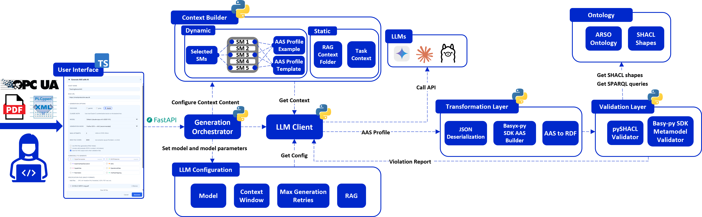

# ARSO Ontology AAS Generation

Ontology-grounded generation, transformation, and validation of Asset Administration Shells (AAS) using Large Language Models (LLMs), RDF projection, SHACL validation, and human-in-the-loop correction.

This repository contains the implementation of a modular framework for generating AAS instances from technical equipment documentation. The framework is centred around the **AAS Resource Structure Ontology (ARSO)**, which provides semantic grounding for LLM-based generation and formal validation through SHACL constraints.

---

## Project Overview

Creating high-quality and interoperable Asset Administration Shells is a manual and knowledge-intensive task. Engineers need to understand the AAS metamodel, relevant IDTA submodel templates, equipment documentation, communication interfaces, and domain-specific modelling conventions.

This project explores how LLMs can support this process when combined with ontology-based grounding and validation. Instead of asking an LLM to generate a complete AAS JSON document directly, the framework generates a compact **AAS profile** containing the asset-specific information. This profile is then normalised, transformed into a full AAS JSON structure, projected to RDF, and validated against ontology-derived SHACL constraints.

The framework consists of three main layers:

1. **Generation**
   - Builds the LLM context from user input, selected submodels, source documents, examples, and ontology-derived guidance.
   - Calls the configured LLM provider.
   - Produces a compact AAS profile.

2. **Transformation**
   - Normalises the generated profile.
   - Expands the profile into a full AAS JSON representation.
   - Builds submodels using dedicated builder classes.
   - Converts the generated AAS into RDF for validation.

3. **Validation**
   - Validates the RDF representation against SHACL constraints derived from ARSO and the AAS ontology.
   - Produces structured validation results.
   - Supports iterative feedback to the LLM and live validation in the editor.

The framework also includes testing material for both SHACL validation and LLM-based AAS generation.

---

## Architecture

The framework is designed to keep the LLM task focused and controllable. The LLM generates only the information that must be authored explicitly, while the deterministic transformation layer handles the full AAS structure, semantic identifiers, and serialisation.

This reduces the risk of malformed AAS JSON and makes the generated output easier to validate, correct, and extend.



---

## Repository Structure

```text
.
├── README.md
├── __init__.py
│
├── Generation/                # LLM-based AAS profile generation
│   ├── pipeline.py            # Main generation pipeline
│   ├── config.py              # Generation configuration
│   ├── prompts.yaml           # Prompt definitions
│   ├── Context_Builder/       # Prompt context construction
│   ├── LLM_Client/            # LLM provider interface
│   └── Parsing/               # PDF/Text parsing utilities
│
├── Ontology/                  # Semantic grounding and validation models
│   ├── AAS/                   # RDF AAS ontology
│   ├── ARSO/                  # AAS Resource Structure Ontology
│   ├── CSS/                   # Capability-Skill-Service ontology
│   └── SHACL/                 # Generated and manual SHACL constraints
│
├── Transformation/            # AAS construction and RDF projection
│   ├── AAS_Builder/           # Profile → full AAS JSON
│   └── AAS_to_RDF/            # AAS JSON → RDF/Turtle
│
├── Validation/                # SHACL validation logic
│   └── Validator/             # SHACL validation runner
│
├── Testing/                   # Evaluation and validation tests
│   ├── Generation_Tests/      # LLM generation experiments
│   └── SHACL_Tests/           # SHACL conformance tests
│
└── ui/                        # Interactive AAS editor frontend
    ├── src/                   # React/TypeScript application source
    ├── public/                # Static assets
    ├── package.json           # Frontend dependencies
    ├── vite.config.ts         # Vite configuration
    └── README.md              # UI-specific documentation
```

---

## Installation

Installation instructions may depend on the local Python environment and the LLM providers used.

Basic setup:

```bash
git clone https://github.com/MartinJensen37/ARSO_Ontology_AAS_Generation.git
cd ARSO_Ontology_AAS_Generation
```

Create and activate a virtual environment:

```bash
python -m venv .venv
```

On Windows:

```bash
.venv\Scripts\activate
```

On Linux/macOS:

```bash
source .venv/bin/activate
```

Install dependencies:

```bash
pip install -r requirements.txt
```

If the repository is configured as an editable Python package, install it with:

```bash
pip install -e .
```

---

## Acknowledgements

This work was supported by **Novo Nordisk AMSAT**.

---

## Licence

This project is licensed under the MIT License.

